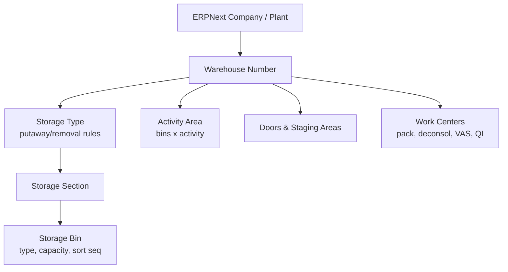
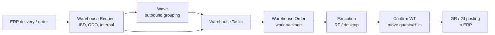
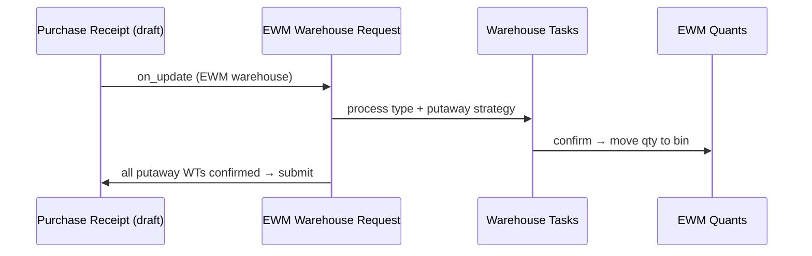
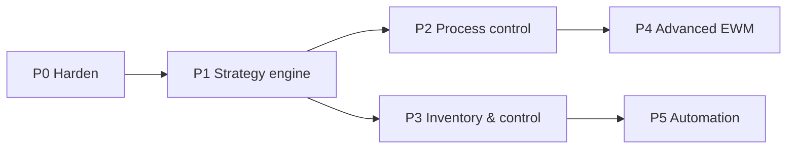

# Frappe EWM → SAP EWM parity: gap analysis & roadmap

2026-09-21 · @Someone · updated 2026-09-22

frappe\_wms already has SAP EWM's backbone (ledger, bins, handling units, warehouse tasks and orders, RF app, monitor), so reaching EWM Basic parity is about 14–18 developer-weeks of hardening and rule engines rather than a rewrite. The first priority is eight defects that let WMS and ERPNext drift apart or leave configured rules unenforced; advanced features (waves, cross-docking, yard, labor, slotting, MFS) follow as optional phases.

**P0 status: complete** (2026-09-22, commits `b39b73f`, `6332aeb`). All 8 defects below are fixed and verified end to end on a live Frappe v16 / ERPNext v16 bench (132 tests passing) — the "Status" line under [First sprint](#first-sprint-2-weeks-p0) previously claimed this same milestone against a commit and test file that never existed in this repo; that claim is superseded by this update.

**P1 status: complete** (2026-09-22, commit `272bf61`). All 6 sub-items shipped and verified on the same live bench (159 tests passing, up from 132). Two design calls made along the way, detailed inline where relevant: `WMS Product` stays global-per-item with a new sibling `WMS Product Warehouse` doctype for per-warehouse overrides (matching SAP's own Product/Warehouse-Product split), and the Removal Rule "strategy class" requirement shipped as a small Python registry resolved through a new `hooks.py` extension point (`wms_removal_strategies`) rather than an OOP class hierarchy, matching this codebase's existing rule-engine style. P2 (process control) is next.

## Current state of frappe-ewm

The repo (`frappe_wms`, Frappe v16) is a working MVP, not a blank start: 58 DocTypes, about 2,900 lines of services/API/events, a 2,560-line RF scanner page at `/wms`, a WMS Monitor page, Spanish translations and 98 tests. It already follows SAP's core pattern: an append-only ledger, bins and HUs, warehouse tasks, and ERPNext documents posted only at goods receipt and goods issue.

### What exists

| Area | Implemented as | Depth |
| --- | --- | --- |
| Structure | WMS Warehouse (1:1 ERPNext Warehouse), Storage Type (8 roles), Storage Bin (aisle/rack/level/position, max HUs/weight/volume, 3 block flags, allowed stock/HU types) | Solid |
| Stock | WMS Stock Ledger Entry (immutable, idempotent) + WMS Stock Balance (7-dimension quant with `FOR UPDATE` locks, rebuildable) | Solid |
| Stock types | WMS Stock Type with availability category and allow flags | Solid |
| Handling units | Nested HUs, HU Type (external/internal numbering, reusable), Packaging Material, HU Event audit trail, number ranges and HU number pool | Solid |
| Execution | Warehouse Request, Warehouse Task (submittable, reversal via compensating task), Warehouse Order with queues, resource groups, RF logon/kick | Solid |
| Putaway | Bin Determination Rule with 6 strategies (fixed, first empty, add to stock, sequence, least utilized, manual) + HU-count/weight capacity filter | Partial |
| Stock removal | Allocation of balances FIFO by first receipt date | Minimal |
| Inbound | Inbound Delivery → Goods Receipt → putaway request/task; PO → Purchase Receipt | Solid |
| Outbound | Outbound Delivery → allocation → pick tasks → Packing Order → Shipment with Route/Stops → auto Goods Issue on load; SO → Delivery Note | Solid |
| Waves | Manual WMS Wave, single-order or cluster picking | Partial |
| Internal | Ad hoc move, deconsolidation, min/target replenishment (hourly), pack/repack | Partial |
| Quality | WMS Quality Inspection as a stock-type split | Partial |
| Physical inventory | Count document: snapshot, count, post variance | Minimal |
| VAS | VAS Order with activity steps | Minimal |
| Exceptions & printing | WMS Exception Code with follow-up actions; print determination + spool queue | Solid |
| ERPNext guard | Blocks direct Stock Entry, Delivery Note, Purchase Receipt, Stock Reconciliation on managed warehouses; daily drift check | Partial |

### Defects and gaps found in the code

1. ~~**Physical inventory differences never reach ERPNext.**~~ **Fixed.** `post_count` now also posts a Stock Entry Material Receipt/Issue for grouped, non-zero variances (pivoted from an originally-planned Stock Reconciliation after live testing showed ERPNext blocks Inventory Dimension values on a non-opening reconciliation).
2. ~~**Standalone goods receipts post at zero value.**~~ **Fixed.** Resolves `Item.valuation_rate` → `last_purchase_rate` → `allow_zero_valuation_rate` only as a last resort.
3. **Storage processes are configured but never executed.** `determine_storage_process` is never called; putaway is hard-wired to `GR_PUTAWAY`, and Storage Process Step fields (`create_task_automatically`, `next_step_on_confirmation`) do nothing. **Still open** — P2 scope, not part of P0.
4. ~~**Storage type and bin rules are not enforced.**~~ **Fixed.** Whitelists, HU-count/weight capacity, and `hu_managed` are always-on; mixed products/batches/stock types are enforced behind a new opt-in `WMS Settings.enforce_storage_type_rules` (default off, since most warehouses have never had their mixing flags reviewed). Volume limits remain unenforced — `Storage Bin` has no `current_volume` tracking field to check against.
5. ~~**Product settings are unused.**~~ **Mostly fixed.** `serial_control`, `batch_control`, `shelf_life_days`, `minimum_remaining_shelf_life` and `preferred_storage_type` are now enforced (receipt-time serial/batch checks, FEFO ordering, SLED exclusion, putaway bias). `full_hu_quantity` is still unused — no clean single integration point, closer to P1/P2 putaway-rounding territory.
6. ~~**Allocation has no row lock.**~~ **Fixed.** `allocate_delivery` now locks and re-reads each balance row immediately before reserving.
7. **No alternative units of measure.** **Partially fixed.** `uom`/`conversion_factor` now exist on Inbound/Outbound Delivery Item and Warehouse Request and are threaded through to the mirrored ERPNext row (correctly back-converted so ERPNext's `stock_qty` doesn't double-apply the factor). Two related bugs were fixed alongside: `create_inbound_delivery_from_purchase_order`/`create_outbound_delivery_from_sales_order` were computing outstanding quantity in the PO/SO's transactional UOM instead of stock UOM. Still no transactional-UOM receiving/picking UI — deliberately scoped down.
8. ~~**Guard gaps.**~~ **Mostly fixed.** The guard now also covers Sales/Purchase Invoice with Update Stock, Subcontracting Receipt/Order, Work Order, Job Card. Production supply (Work Order staging/FG receipt routed through WMS) is still missing — P2 scope.

## How SAP EWM is built

SAP EWM is a layer of three things: a physical warehouse structure, warehouse-specific master data, and a chain of execution documents that every movement flows through. Copying that three-layer split is the single most important design choice for Frappe EWM.

### Warehouse structure

Bins belong to exactly one storage type and section; activity areas are an overlay that groups bins per activity (pick, putaway, count) and drives the walking sequence.

| Element | Purpose | Key attributes |
| --- | --- | --- |
| Warehouse Number | One EWM-managed site, linked to an ERP plant + storage location | Default UoMs, quant/HU settings, calendar |
| Storage Type | Zone with its own rules (high rack, bulk, fixed-bin pick, staging, doors, work centers) | Role, storage behavior (standard, bulk, pallet, flexible), putaway rules, capacity check, mixed storage, HU requirement |
| Storage Section | Sub-zone of a storage type (fast/slow movers, heavy) | Used by section search for putaway |
| Storage Bin | Smallest addressable location | Bin type, max weight/volume/capacity, verification field, sort sequence, blocking indicators |
| Activity Area | Logical grouping of bins for one activity | Bin sort sequence, PI area, queue determination |
| Door / Staging Area | Where goods leave or enter | Staging-area-and-door determination |
| Work Center | Physical station for packing, deconsolidation, QI, VAS | Storage type role "work center", inbound/outbound sections |

### Master data

- **Warehouse product**: per-warehouse product settings — putaway control indicator, stock removal control indicator, section indicator, bin type, process type determination indicator, fixed bins, min/max replenishment qty, slotting data.
- **Packaging specification**: levels (each → case → pallet), packaging materials, work steps; drives HU creation and capacity.
- **Handling unit (HU)**: a physical packing unit with its own ID, packaging material, weight/volume, nested HUs and contents. Quants live in bins or inside HUs.
- **Quant**: stock record = product + batch + stock type + owner/party entitled + location (bin or HU) + quantity + GR date + shelf-life date.
- **Resources, queues, users**: forklifts, pickers and RF users; queues group warehouse orders for assignment.
- **Routes, business partners, locations**: inherited from ERP for shipping and receiving.

### Execution documents

- **Warehouse request** (inbound delivery, outbound delivery order, posting change, stock transfer) carries what should happen; each item gets a **warehouse process type** that decides source/destination, activity and storage process.
- **Warehouse task (WT)** is the atomic move: product or HU, from bin to bin, created by strategies and confirmed by a user.
- **Warehouse order (WO)** bundles WTs into one unit of work via warehouse order creation rules (filters, limits, sort, packing profile), assigned to a queue.
- **Storage control** splits a move into steps: process-oriented (unload → count → deconsolidate → QI → VAS → putaway; pick → VAS → pack → stage → load) and layout-oriented (forced intermediate points like I-points or lifts). POSC works only with HUs, and wins over LOSC when both apply.

The warehouse process type is chosen from a determination table keyed on document type, item type, delivery priority and the product's process type determination indicator, with SAP defining seven process categories: putaway, stock removal, internal movement, posting change, plus system-only GR, GI and physical inventory ([SAP Learning](https://learning.sap.com/courses/basic-customizing-in-sap-s-4hana-ewm/applying-warehouse-process-types)).

## SAP EWM capability map

SAP EWM covers about 30 capability areas; roughly two thirds are "Basic" and the rest are licensed as "Advanced" ([LeverX](https://leverx.com/newsroom/sap-ewm-basic-vs-advanced)). The table groups them by domain; "Today" rates the current frappe\_wms code as of the P1 strategy-engine sprint (2026-09-22): 11 areas are done, 10 partial or minimal and 9 missing.

| Area | What SAP EWM does | Tier | Today in frappe\_wms | Next step |
| --- | --- | --- | --- | --- |
| Warehouse structure | Warehouse number, storage types, sections, bins, bin types, activity areas, doors, staging areas, work centers | Basic | Partial: types, bins, door/staging roles, now with Storage Section and Bin Type; no Activity Area | Add Activity Area; bulk bin generator |
| Quants & stock types | Stock by bin/HU with stock type, batch, owner, GR/SLED dates | Basic | Done: WMS Stock Balance + ledger, now with `shelf_life_expiry_date`; no owner dimension | Add owner dimension |
| Handling units | Nested HUs, packaging materials, HU types, HU WTs, history, SSCC labels | Basic | Done | SSCC (GS1) number range option |
| Packaging specification | Levels each/case/pallet, work steps | Basic | Missing (only `full_hu_quantity`) | Packaging Spec with levels; drive GR and packing |
| Warehouse process types | Control per movement: category, source/dest, activity, storage process | Basic | Done: a `Warehouse Process Type Determination Rule` engine now drives all 6 real hardcoded call sites (Putaway/Pick/Internal Move/Replenish/Deconsolidation), falling back to each site's original literal when unconfigured | Extend determination to the still-hardcoded Stage/Load choice in shipping.py |
| Warehouse tasks & orders | Atomic moves bundled by WO creation rules (filters, limits, sort, packing profile, queue) | Basic | Partial: tasks and orders solid; WO grouping by batch key only | WO Creation Rule with limits and sort |
| Putaway strategies | Fixed bin, empty bin, add to stock, bulk, pallet, near fixed bin, general storage; search sequence; capacity check | Basic | Done: 10 strategies (the original 6 plus Bulk, Pallet, Near Fixed Bin, General Storage), enforced against whitelists/capacity/`hu_managed` (always-on) and mixing (behind a setting), plus a Storage Type Search Sequence to try several storage types in order | Weight/volume-aware bulk ranking beyond HU count |
| Stock removal strategies | FIFO, stringent FIFO, LIFO, FEFO, partial qty first, by quantity, fixed bin | Basic | Done: a `Removal Rule` engine with all 7 named strategies plus a custom sort-fields override, resolved through a `hooks.py` extension point (`wms_removal_strategies`) other apps can add to; "stringent" enforcement is sort-only, not yet a hard cross-allocation block | True stringent-FIFO validation across concurrent allocations |
| Inbound processing | Delivery, unload, count, deconsol, QI, VAS, putaway, GR posting | Basic | Done for GR + putaway, now with real valuation and serial/batch/SLED checks; multi-step missing | Execute storage processes |
| Outbound processing | ODO, route, pick, pack, stage, load, GI, pick denial | Basic | Done | Pick denial and short-pick follow-up |
| Internal movements | Ad hoc moves, replenishment types, posting changes, rearrangement | Basic | Partial: ad hoc, min/target replenishment | Order-related and direct replenishment |
| Storage control | Process- and layout-oriented multi-step moves | Basic | Partial: config only, never executed | Step engine chaining tasks |
| Physical inventory | Annual, ad hoc, cycle counting, low stock, putaway PI; tolerances; recount | Basic | Partial: ad hoc count, now posted to ERPNext (Stock Entry gain/loss) | PI procedures, tolerances, recount |
| Batches, serials, SLED | Batch/serial at warehouse level, shelf-life checks | Basic | Done: batch/serial control enforced at receipt, SLED tracked and drives FEFO | — |
| Quality inspection | Inspection rules at GR, sampling, QI stock type | Basic | Partial: manual stock-type split | Auto-create at GR from inspection rules; link ERPNext QI |
| Production supply | Staging for work orders, PSA, receipt from production | Basic | Missing | Work Order staging and FG receipt |
| RF / mobile | Guided screens, scanning, verification | Basic | Done: `/wms` with 10 actions | Bin/product verification fields |
| Warehouse monitor | Central cockpit | Basic | Done | Alerts and mass actions |
| Exception handling | Exception codes with follow-up workflows | Basic | Done | Wire more follow-ups |
| Wave management | Templates, automatic release, cut-off times | Advanced | Partial: manual waves | Wave templates and scheduled release |
| Cross-docking | Opportunistic, planned | Advanced | Missing | Opportunistic cross-dock at putaway |
| Value-added services | VAS orders at work centers | Advanced | Partial | Tie to packaging spec, time capture |
| Kitting | Kit to order/stock, reverse kitting | Advanced | Missing | BOM-based kit orders |
| Slotting & rearrangement | Optimize putaway parameters; rearrange | Advanced | Missing | Scheduled slotting analysis |
| Labor management | Standards, planned vs actual, performance | Advanced | Missing (timestamps exist) | Standards table, performance report |
| Yard management | Yard bins, transport units, check-in/out | Advanced | Partial: route stops of type Yard | Transport Unit and yard moves |
| Dock appointment scheduling | Door slots booked by carriers | Advanced | Missing | Appointment calendar |
| Shipping & carrier | Transport units, loading, freight docs | Advanced | Done: Shipment, route, seal, load sequence | Carrier integration |
| Material flow system | PLC/conveyor/ASRS | Advanced | Missing | REST/MQTT adapter |
| Warehouse billing | 3PL charges | Advanced | Missing | Billing measurement to Sales Invoice |

## Target data model

Keep the repo's existing names; 13 of the 17 P1 DocTypes below already exist, some under different names, so the target model mostly adds rule tables and enforcement rather than new core objects. The tables that follow use the generic `EWM` names; this mapping shows which ones are already built.

**P1 update (2026-09-22):** `EWM Warehouse Item`'s "per warehouse" split shipped as a new sibling doctype (`WMS Product Warehouse`, item+warehouse, fixed bin/preferred storage type/process-indicator overrides) rather than mutating `WMS Product` itself — its fields are genuinely item-global (shelf life, batch/serial control), matching SAP's own Product-vs-Warehouse-Product split; see the P1 sprint status note below the checklist for why. `EWM Process Type Determination` shipped as a distinct new doctype (`Warehouse Process Type Determination Rule`) rather than reusing `Process Determination Rule`, which continues to serve only Storage Process determination (P2, still unwired) — the two concepts (which *Warehouse Process Type* handles a movement vs. which *Storage Process* executes it) turned out to need separate rule tables with different match keys (delivery priority, product indicator) once implemented.

| Target name | Existing in frappe\_wms | Action |
| --- | --- | --- |
| EWM Warehouse / Storage Type / Storage Bin | WMS Warehouse / Storage Type / Storage Bin | Extended (Storage Section, Bin Type, Storage Type Search Sequence) ✅ P1 |
| EWM Quant | WMS Stock Balance | Extend (expiry date done ✅ P0; owner still open) |
| EWM Stock Movement Log | WMS Stock Ledger Entry | Keep |
| EWM Handling Unit / HU Type / Packaging Material | Handling Unit / Handling Unit Type / Packaging Material | Keep |
| EWM Warehouse Item | WMS Product + new `WMS Product Warehouse` | Done ✅ P1 (see note above) |
| EWM Warehouse Process Type | Warehouse Process Type | Keep |
| EWM Process Type Determination | New `Warehouse Process Type Determination Rule` (see note above) | Done ✅ P1 - wired into all 6 real hardcoded call sites |
| Putaway rules | Bin Determination Rule | Done ✅ P1 (search sequence, Bulk/Pallet/Near Fixed Bin/General Storage, enforcement via P0's `bin_rules.py`) |
| EWM Removal Rule | New `Removal Rule` doctype + `services/removal_rules.py` | Done ✅ P1 |
| EWM Warehouse Request / Task / Order | Warehouse Request / Warehouse Task / Warehouse Order | Keep; add WO Creation Rule |
| EWM Storage Process | Storage Process + Storage Process Step | Execute it |
| EWM Wave | WMS Wave | Add templates |
| EWM PI Document | WMS Physical Inventory Count | Add procedures, tolerances, ERPNext posting |
| EWM Resource / Queue / Exception Code | WMS Resource / Warehouse Queue / WMS Exception Code | Keep |
| Inbound / outbound requests | Inbound Delivery, Outbound Delivery, Goods Receipt, Goods Issue | Keep |

### Structure & master data

| DocType | Kind | Key fields | Phase |
| --- | --- | --- | --- |
| EWM Warehouse | Master | erpnext\_warehouse (Link Warehouse), company, default HU type, quant date mode, stock type defaults | P1 |
| EWM Storage Type | Master | warehouse, role (standard/work center/door/staging/yard/PSA), storage behavior, putaway rule, capacity check method, mixed storage, HU required, allowed HU types, confirm putaway, stock removal rule | P1 |
| EWM Storage Section | Master | storage type, code | P1 |
| EWM Bin Type | Master | max weight, max volume, dimensions | P1 |
| EWM Storage Bin | Master | warehouse, storage type, section, bin type, aisle/stack/level/position, max weight/volume/capacity, verification code, putaway/removal blocked, fixed item, sort sequence | P1 |
| EWM Activity Area | Master | warehouse, activity (pick/put/count), bins child table with walk sequence | P2 |
| EWM Door / EWM Staging Area | Master | warehouse, storage type, bin, direction | P2 |
| EWM Work Center | Master | storage type, role (pack, deconsol, QI, VAS), inbound/outbound sections | P2 |
| EWM Warehouse Item | Master | item, warehouse, putaway control indicator, removal control indicator, section indicator, bin type, process type indicator, min/max replenishment, fixed bins child table, ABC class | P1 |
| EWM Packaging Spec | Master | item, levels child table (qty, HU type, packaging material), work steps | P2 |
| EWM HU Type / Packaging Material | Master | tare weight, max weight/volume, dimensions, closed flag | P1 |
| EWM Resource / EWM Queue | Master | resource type, user, queues, activity areas | P2 |
| EWM Exception Code | Config | business context, follow-up action | P2 |

### Stock

| DocType | Kind | Key fields | Phase |
| --- | --- | --- | --- |
| EWM Quant | Ledger (non-submittable, system-written) | item, batch, serial, qty, uom, stock type, owner/party entitled, bin, HU, GR datetime, SLED, last movement | P1 |
| EWM Handling Unit | Transactional | HU ID (SSCC), HU type, packaging material, parent HU, location bin, status (planned/real/closed/shipped), weight/volume, contents via quants | P1 |
| EWM Stock Movement Log | Ledger | WT, from/to bin, from/to HU, qty, posting datetime; audit and history | P1 |

### Control & execution

| DocType | Kind | Key fields | Phase |
| --- | --- | --- | --- |
| EWM Warehouse Process Type | Config | category (putaway/removal/internal/posting change), activity, source/dest storage type & bin, storage process, auto-confirm, WO creation allowed | P1 |
| EWM Process Type Determination | Config | ref doctype, item type, priority, indicator → process type | P1 |
| EWM Storage Type Search Sequence | Config | warehouse, direction, putaway/removal control indicator, stock type, ordered storage types | P1 |
| EWM Removal Rule | Config | rule code, sort fields child table (field, asc/desc), strategy class | P1 |
| EWM Storage Process | Config | direction, ordered steps (unload, count, deconsol, QI, VAS, pack, stage, load, putaway) with storage type per step | P3 |
| EWM Warehouse Request | Transactional | direction (inbound/outbound/internal/posting change), ref doctype/docname (Purchase Receipt, Delivery Note, Stock Entry, Work Order), items child table with process type, status per step | P1 |
| EWM Warehouse Task | Submittable | process type, warehouse request + item, item/batch/qty or HU, source bin/HU, dest bin/HU, status (open/confirmed/cancelled), confirmed qty, difference qty, exception code, user, timestamps | P1 |
| EWM Warehouse Order | Transactional | queue, creation rule, assigned resource, status, tasks child table, planned/actual duration | P1 |
| EWM WO Creation Rule | Config | activity area, filters, limits (items, weight, volume, time), sort fields, packing profile | P2 |
| EWM Wave / Wave Template | Transactional / Config | release method, cut-off, wave category, requests | P3 |
| EWM PI Document | Submittable | procedure (annual/ad hoc/cycle/low stock/putaway), bin or item scope, count lines, book qty, counted qty, difference, recount, tolerance group | P2 |
| EWM Transport Unit / Yard Move / Dock Appointment | Transactional | carrier, door, check-in/out, loaded HUs | P4 |
| EWM VAS Order / Kit Order | Transactional | work center, steps, auxiliary items, time | P4 |

### Core design rules

- **Quant table is the warehouse truth, ERPNext Stock Ledger the financial truth.** They reconcile at the ERPNext Warehouse level; a scheduled check flags drift.
- **Only confirmed WTs change quants.** Every WT confirmation writes quant deltas and a movement log row in one DB transaction, with `SELECT … FOR UPDATE` on affected quants.
- **ERPNext posts only at GR and GI and for stock type changes that matter financially.** Bin-to-bin moves inside one ERPNext Warehouse never create Stock Entries.
- **Strategies are code, rules are data.** Each putaway/removal rule is a registered Python class; storage types and search sequences pick which one runs, and `hooks.py` lets other apps add strategies.

## ERPNext integration design

Frappe EWM should behave like SAP's embedded EWM: ERPNext owns orders, accounting and the stock ledger per Warehouse; EWM owns everything below the Warehouse (bins, HUs, tasks). An ERPNext Warehouse flagged `is_ewm_managed` hands its physical moves to EWM.

**Decided:** Frappe EWM takes over movement control for EWM-managed warehouses. Users create and confirm moves only in EWM; ERPNext stock documents for those warehouses are generated and submitted by EWM, and ERPNext keeps valuation, accounting and order management.

Today the repo already starts from ERPNext orders (PO/SO → Inbound/Outbound Delivery) and mirrors Goods Receipt/Issue as Purchase Receipt, Delivery Note or Material Receipt/Issue. The takeover decision needed five changes:

1. ~~Post physical inventory differences as ERPNext Stock Reconciliation (or Material Receipt/Issue) so counts stop causing drift.~~ **Done** — as Stock Entry Material Receipt/Issue, not Stock Reconciliation (see defect #1 above).
2. ~~Value standalone receipts from the item's valuation or last purchase rate instead of `allow_zero_valuation_rate`.~~ **Done.**
3. ~~Add a `WMS Stock Type` Inventory Dimension on stock transactions and set it on every mirrored document.~~ **Done** — verified live: `apply_to_all_doctypes=1` fans out to ~35 doctypes, including frappe\_wms's own (Goods Receipt/Issue Item, WMS Stock Balance/Ledger Entry, Warehouse Task, Stock Allocation, …).
4. Extend the guard to Sales/Purchase Invoice with Update Stock, Work Order, Job Card, Subcontracting and Asset flows, and route Work Order staging and finished-goods receipt through WMS. **Guard extension done.** Work Order staging/FG receipt routing still not built — production supply remains P2 scope.
5. Mirror transfers between two managed warehouses through an ERPNext in-transit warehouse: GI posts a Material Transfer into transit, GR posts it out. **Still open** — no code for this exists anywhere yet.

| ERPNext event | EWM reaction | Posts back to ERPNext |
| --- | --- | --- |
| Purchase Receipt saved as draft (or Purchase Order "expected") for an EWM warehouse | Create inbound Warehouse Request; unload/putaway WTs | Purchase Receipt submitted at GR confirmation (or at putaway, configurable) |
| Delivery Note draft / Sales Order released / Pick List created | Create outbound Warehouse Request; wave or direct WTs via removal strategy | Delivery Note submitted at GI (after loading); short picks reduce qty |
| Stock Entry Material Transfer between two EWM warehouses | Outbound request at source, inbound at target | Stock Entry submitted at GI/GR |
| Work Order material transfer | Production staging request to PSA | Stock Entry (Material Transfer for Manufacture) |
| Work Order finished goods | Inbound request from production | Stock Entry (Manufacture) at receipt |
| Quality Inspection accepted/rejected | Posting change QI → unrestricted or blocked | Material Transfer inside the same Warehouse that changes the stock-type Inventory Dimension |
| PI document posted | Difference computed per bin, aggregated per item/batch | Stock Reconciliation |

### Guardrails in ERPNext

- `doc_events` on Stock Entry, Purchase Receipt, Delivery Note, Stock Reconciliation: block manual submit for EWM-managed warehouses unless the call comes from EWM (flag in `frappe.flags`).
- Custom fields: `is_ewm_managed` on Warehouse; `ewm_warehouse_request` on Purchase Receipt, Delivery Note, Stock Entry; `ewm_putaway_indicator` etc. only if not kept in EWM Warehouse Item.
- Stock types map to ERPNext by config: one ERPNext Warehouse per EWM Warehouse, no extra warehouses for QI or blocked stock. The stock type (unrestricted, QI, blocked, in putaway) is exposed in ERPNext as an Inventory Dimension on stock transactions, so reports and finance still see it.
- Batches, serial numbers, UoM conversion and item barcodes are read from ERPNext; EWM never duplicates those masters.

The sequence shows the default inbound path; the outbound path mirrors it with Delivery Note, removal strategy and GI.

## Phased roadmap

Because the core engine already exists, the roadmap starts with hardening and then fills strategy and process gaps; phases P0–P3 reach SAP EWM Basic parity in about 14–18 developer-weeks. Effort assumes one experienced Frappe developer and is a rough planning figure.

| Phase | Goal | Scope | Effort (dev-weeks) | Done when |
| --- | --- | --- | --- | --- |
| P0 — Harden ✅ | Stock and money always agree with ERPNext | Fix the 8 defects: PI posting to ERPNext, receipt valuation, allocation locking, enforce storage type/bin rules, batch/serial/SLED controls, alternative UoMs, guard coverage, stock-type Inventory Dimension; drift check as a report with a fix action | 2–3 | **Complete 2026-09-22** (commits `b39b73f`, `6332aeb`): drift-check tests pass, concurrency re-fetch-under-lock tests pass, 132 tests green on a live bench |
| P1 — Strategy engine ✅ | Putaway and removal decided by configurable rules, as in SAP | Storage sections, bin types, storage type search sequence; putaway rules bulk, pallet, near fixed bin, general storage; Removal Rule engine (FIFO, LIFO, FEFO, stringent FIFO, partial qty first, by quantity, fixed bin); WMS Product per warehouse with fixed bins; process type determination on every request | 4–5 | **Complete 2026-09-22** (commit `272bf61`): same receipt lands in different bins by changing only rules (`test_bin_determination_strategies.py`); FEFO pick passes SLED check and a configured Removal Rule changes ordering (`test_removal_rules.py`); 159 tests green on a live bench |
| P2 — Process control | Multi-step inbound and outbound | Execute Storage Processes (unload → count → QI → deconsol → VAS → putaway; pick → pack → stage → load); layout-oriented I-points; QI auto-created from inspection rules and linked to ERPNext Quality Inspection; Packaging Spec; WO Creation Rules (filters, limits, sort); pick denial; order-related and direct replenishment; production supply for Work Orders | 5–6 | A pallet goes GR → QI → deconsol → putaway as chained tasks; a Work Order is staged and receipted through WMS |
| P3 — Inventory & control | Audit-ready counting and supervision | PI procedures (annual, ad hoc, cycle counting by ABC, low/zero stock, putaway PI, bin check), tolerance groups, recount, difference analyzer, approval; monitor alerts and mass actions; RF bin/product verification; KPI dashboard | 3–4 | Cycle counts run on schedule; differences above tolerance need approval |
| P4 — Advanced EWM | Advanced-license features, each optional | Wave templates with cut-offs and auto release; opportunistic cross-docking; kitting; slotting and rearrangement; labor management; transport units, yard moves, dock appointments; VAS depth; 3PL billing | 12–16 | Feature-by-feature, each behind a setting |
| P5 — Automation | Automated warehouses | MFS adapter (REST/MQTT telegrams for conveyors, AS/RS), graphical warehouse layout, public API for devices | 6–8 | A simulated conveyor confirms HU moves over the API |

P2 and P3 can run in parallel with two developers, because P3 only needs the removal engine and stock types from P1.

### First sprint (2 weeks): P0 — complete

- [x] Post PI differences to ERPNext and add a test that the drift check stays empty
- [x] Value standalone Material Receipts (valuation rate or last purchase rate); remove `allow_zero_valuation_rate`
- [x] Lock balances in `allocate_delivery` (`FOR UPDATE`) and add a concurrent-allocation test
- [x] Enforce storage type mixing, HU-managed, volume capacity and bin whitelists in one `validate_destination_bin()` used by tasks and moves
- [x] Enforce WMS Product batch/serial control and minimum remaining shelf life at GR and pick
- [x] UoM conversion on deliveries and mirrored ERPNext rows
- [x] Extend the ERPNext guard to invoices with Update Stock, Work Order, Job Card, Subcontracting
- [x] Create the `WMS Stock Type` Inventory Dimension on install and fill it on mirrored documents

Status (2026-09-22): all 8 items are coded and tested in `frappe_wms/tests/` (`test_erpnext_stock_guard.py`, `test_allocation.py`, `test_bin_rules.py`, `test_erpnext_sync.py`, `test_wms_product.py`, `test_physical_inventory_count.py`), verified on a real bench — 132 tests passing, commits `b39b73f` and `6332aeb`. Volume capacity is not enforced (`Storage Bin` has no `current_volume` field to check against — a real gap, not silently faked). A true two-session concurrent-allocation test still can't be exercised (single-process test suite); the shipped test proves the re-fetch-under-lock logic instead. Storage-rule mixing enforcement ships behind `WMS Settings.enforce_storage_type_rules`, off by default; whitelist/capacity/`hu_managed` checks are always-on. `Warehouse Request` also gained `uom`/`conversion_factor` fields (commit `6332aeb`) ahead of a planned use distinguishing pick reasons (order picking vs. internal vs. a future 2-bin system) — schema only, nothing reads them yet.

## Risks and open decisions

The biggest risk is two stock truths drifting apart (EWM quants vs ERPNext Stock Ledger); every design choice above is aimed at keeping a single write path.

| Risk | Impact | Mitigation |
| --- | --- | --- |
| Quants and Stock Ledger drift | Wrong availability, audit failures | Keep `services/stock.post_entries` as the only write path, close the guard gaps, turn the daily drift log into a report |
| Concurrency on hot bins | Negative or double-picked stock | Row locks on quants, idempotent WT confirmation, retry on deadlock |
| Scope creep toward full SAP parity | Nothing ships | Ship per phase; P4 features as optional modules behind settings |
| Performance with large bin/quant counts | Slow strategies | Indexed quant table (warehouse, item, stock type, bin), strategy queries in SQL not Python loops |
| ERPNext version changes | Broken hooks | Pinned to v16; CI against it |

### Decisions needed

- [ ] Target ERPNext/Frappe major version (v16)
- [ ] Stock types: EWM-only inside one ERPNext Warehouse, but visible different stock types inside ERPNext for QI/blocked
- [ ] GR posting moment: at unloading/GR confirmation or after putaway: configurable
- [ ] RF client: Frappe desk page, standalone PWA, or Frappe UI (Vue) app both, a desktop version and also and rfui for handscanners
- [ ] License and P4 features stay in the same app

### Sources

- [SAP Learning — Applying Warehouse Process Types](https://learning.sap.com/courses/basic-customizing-in-sap-s-4hana-ewm/applying-warehouse-process-types)
- [SAP Learning — Applying Putaway Rules](https://learning.sap.com/courses/basic-customizing-in-sap-s-4hana-ewm/applying-putaway-rules)
- [SAP Learning — Applying the Stock Removal Strategies](https://learning.sap.com/courses/basic-customizing-in-sap-s-4hana-ewm/applying-the-stock-removal-strategies)
- [SAP Learning — Creating Warehouse Orders](https://learning.sap.com/courses/basic-customizing-in-sap-s-4hana-ewm/creating-warehouse-orders)
- [SAP Learning — Applying Wave Management](https://learning.sap.com/courses/processes-in-sap-s-4hana-ewm/applying-wave-management)
- [SAP Learning — Setting Up the Procedures for Physical Inventory](https://learning.sap.com/courses/basic-customizing-in-sap-s-4hana-ewm/setting-up-the-procedures-for-physical-inventory)
- [SAP Learning — Configuring Process-Oriented Storage Control](https://learning.sap.com/courses/basic-customizing-in-sap-s-4hana-ewm/configuring-process-oriented-storage-control)
- [SAP Learning — Outlining the Goods Issue Process in SAP EWM](https://learning.sap.com/courses/basic-customizing-in-sap-s-4hana-ewm/outlining-the-goods-issue-process-in-sap-ewm)
- [SAP PRESS — Inbound Processing in Embedded EWM](https://blog.sap-press.com/what-happens-during-inbound-processing-in-sap-embedded-ewm)
- [LeverX — SAP EWM Basic vs Advanced](https://leverx.com/newsroom/sap-ewm-basic-vs-advanced)

help.sap.com blocks automated reading, so SAP Learning course pages were used as the SAP-authored source; details not on those pages come from general EWM knowledge.

