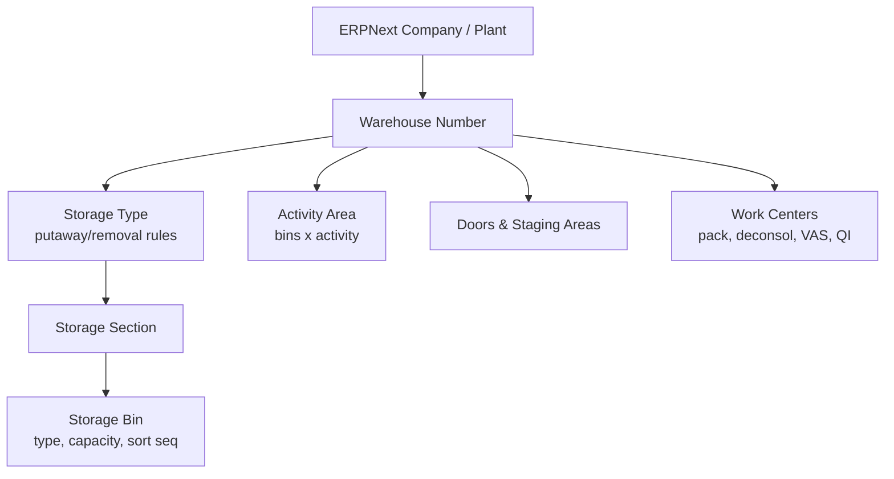
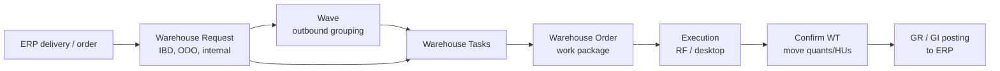
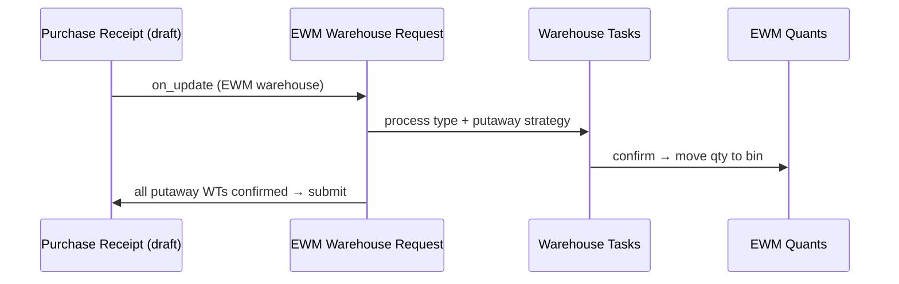
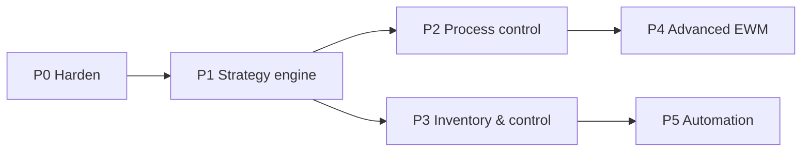

# Frappe EWM → SAP EWM parity: gap analysis & roadmap

2026-09-21 · @Someone · updated 2026-09-22

frappe\_wms already has SAP EWM's backbone (ledger, bins, handling units, warehouse tasks and orders, RF app, monitor), so reaching EWM Basic parity is about 14–18 developer-weeks of hardening and rule engines rather than a rewrite. The first priority is eight defects that let WMS and ERPNext drift apart or leave configured rules unenforced; advanced features (waves, cross-docking, yard, labor, slotting, MFS) follow as optional phases.

**P0 status: complete** (2026-09-22, commits `b39b73f`, `6332aeb`). All 8 defects below are fixed and verified end to end on a live Frappe v16 / ERPNext v16 bench (132 tests passing) — the "Status" line under [First sprint](#first-sprint-2-weeks-p0) previously claimed this same milestone against a commit and test file that never existed in this repo; that claim is superseded by this update.

**P1 status: complete** (2026-09-22, commit `272bf61`). All 6 sub-items shipped and verified on the same live bench (159 tests passing, up from 132). Two design calls made along the way, detailed inline where relevant: `WMS Product` stays global-per-item with a new sibling `WMS Product Warehouse` doctype for per-warehouse overrides (matching SAP's own Product/Warehouse-Product split), and the Removal Rule "strategy class" requirement shipped as a small Python registry resolved through a new `hooks.py` extension point (`wms_removal_strategies`) rather than an OOP class hierarchy, matching this codebase's existing rule-engine style.

**P2 status: complete** (2026-09-22). All 8 sub-items shipped and verified on the same live bench (185 tests passing, up from 159). See the [P2 sprint status](#p2-sprint-process-control--complete) note below the phased roadmap for the design calls made along the way — the two most consequential: Work Order and Job Card were removed from the ERPNext stock guard's doc-level checks (they never posted stock directly; the real posting is still fully guarded via Stock Entry), since production supply's whole point is planning a WMS-managed warehouse as a Work Order's own source/wip/fg warehouse; and FG receipt from a Work Order mirrors to a plain Material Receipt Stock Entry rather than ERPNext's "Manufacture" purpose, which hard-requires backflush (raw-material consumption) rows this receipt-only flow doesn't produce — confirmed by an actual `ValidationError` on the live bench, not assumed.

**P3 status: complete** (2026-09-22). All 8 sub-items shipped and verified on the same live bench (215 tests passing, up from 185). This phase was genuinely greenfield — a repo-wide grep for "tolerance", "recount", "cycle_count", "abc_indicator", "KPI", "dashboard", "alert" turned up nothing to wire up, unlike every prior phase. One real bug found and fixed along the way, outside the phase's own stated scope: `Warehouse Order.started_at` was never set at all for a WO that completes within a single `sync_warehouse_order` call (a single-task WO, most commonly) — it only fired from the "In Process" branch, which a same-call completion skips entirely. See the [P3 sprint status](#p3-sprint-inventory--control--complete) note below the phased roadmap for this and the other design calls made along the way.

**P4 status: complete** (2026-09-22) — 7 of 8 Advanced-tier areas, by explicit user choice. All 7 sub-items shipped and verified on the same live bench (242 tests passing, up from 215). Like P4's other 7 areas, this phase was genuinely greenfield — three parallel Explore passes at planning time confirmed zero dead schema anywhere in P4's scope, unlike every prior phase which had at least some unwired fields to pick up. **Yard management / transport units / dock appointment scheduling was deliberately left out of this pass** — the user selected 7 of the 8 Advanced-tier roadmap areas, and `WMS Route Stop.stop_type="Yard"` stays exactly what research found it to be: a purely descriptive label with zero behavioral logic. See the [P4 sprint status](#p4-sprint-status-advanced-ewm--complete) note below the phased roadmap for the design calls made along the way — the most consequential: a `WMS Stock Balance` row's `handling_unit` dimension has to be looked up and targeted explicitly for Kitting consumption (posting loose against HU-tied stock silently misses it, landing on an empty balance row instead of throwing), and cross-docking's warehouse-wide demand matching is *correct* production behavior that happened to collide with three pre-existing test files' shared fixtures, fixed as a test-isolation problem rather than by weakening the feature.

## Current state of frappe-ewm

The repo (`frappe_wms`, Frappe v16) is a working MVP, not a blank start: 58 DocTypes, about 2,900 lines of services/API/events, a 2,560-line RF scanner page at `/wms`, a WMS Monitor page, Spanish translations and 98 tests. It already follows SAP's core pattern: an append-only ledger, bins and HUs, warehouse tasks, and ERPNext documents posted only at goods receipt and goods issue.

### What exists

| Area | Implemented as | Depth |
| --- | --- | --- |
| Structure | WMS Warehouse (1:1 ERPNext Warehouse), Storage Type (8 roles), Storage Bin (aisle/rack/level/position, max HUs/weight/volume, 3 block flags, allowed stock/HU types) | Solid |
| Stock | WMS Stock Ledger Entry (immutable, idempotent) + WMS Stock Balance (7-dimension quant with `FOR UPDATE` locks, rebuildable) | Solid |
| Stock types | WMS Stock Type with availability category and allow flags | Solid |
| Handling units | Nested HUs, HU Type (external/internal numbering, reusable), Packaging Material, HU Event audit trail, number ranges and HU number pool | Solid |
| Execution | Warehouse Request, Warehouse Task (submittable, reversal via compensating task), Warehouse Order with queues, resource groups, RF logon/kick | Solid |
| Putaway | Bin Determination Rule with 6 strategies (fixed, first empty, add to stock, sequence, least utilized, manual) + HU-count/weight capacity filter | Partial |
| Stock removal | Allocation of balances FIFO by first receipt date | Minimal |
| Inbound | Inbound Delivery → Goods Receipt → putaway request/task; PO → Purchase Receipt | Solid |
| Outbound | Outbound Delivery → allocation → pick tasks → Packing Order → Shipment with Route/Stops → auto Goods Issue on load; SO → Delivery Note | Solid |
| Waves | Manual WMS Wave, single-order or cluster picking | Partial |
| Internal | Ad hoc move, deconsolidation, min/target replenishment (hourly), pack/repack | Partial |
| Quality | WMS Quality Inspection as a stock-type split | Partial |
| Physical inventory | Count document: snapshot, count, post variance | Minimal |
| VAS | VAS Order with activity steps | Minimal |
| Exceptions & printing | WMS Exception Code with follow-up actions; print determination + spool queue | Solid |
| ERPNext guard | Blocks direct Stock Entry, Delivery Note, Purchase Receipt, Stock Reconciliation on managed warehouses; daily drift check | Partial |

### Defects and gaps found in the code

1. ~~**Physical inventory differences never reach ERPNext.**~~ **Fixed.** `post_count` now also posts a Stock Entry Material Receipt/Issue for grouped, non-zero variances (pivoted from an originally-planned Stock Reconciliation after live testing showed ERPNext blocks Inventory Dimension values on a non-opening reconciliation).
2. ~~**Standalone goods receipts post at zero value.**~~ **Fixed.** Resolves `Item.valuation_rate` → `last_purchase_rate` → `allow_zero_valuation_rate` only as a last resort.
3. ~~**Storage processes are configured but never executed.**~~ **Fixed (P2).** `create_putaway_requests` now calls `determine_storage_process` (opt-in — a receipt with no matching `Process Determination Rule` still gets the flat `GR_PUTAWAY` request, unchanged); `create_task_automatically`/`next_step_on_confirmation` drive real chaining via a new `services/storage_process.py`, gated by a new cross-Warehouse-Order `predecessor_task` hold (the existing Warehouse Order sequence gate only spans one WO/queue, which successive chain steps naturally leave). Layout-oriented (LOSC) forced waypoints are handled as ordinary extra Storage Process steps rather than a second parallel mechanism — see the P2 sprint status note.
4. ~~**Storage type and bin rules are not enforced.**~~ **Fixed.** Whitelists, HU-count/weight capacity, and `hu_managed` are always-on; mixed products/batches/stock types are enforced behind a new opt-in `WMS Settings.enforce_storage_type_rules` (default off, since most warehouses have never had their mixing flags reviewed). Volume limits remain unenforced — `Storage Bin` has no `current_volume` tracking field to check against.
5. ~~**Product settings are unused.**~~ **Mostly fixed.** `serial_control`, `batch_control`, `shelf_life_days`, `minimum_remaining_shelf_life` and `preferred_storage_type` are now enforced (receipt-time serial/batch checks, FEFO ordering, SLED exclusion, putaway bias). `full_hu_quantity` is still unused — no clean single integration point, closer to P1/P2 putaway-rounding territory.
6. ~~**Allocation has no row lock.**~~ **Fixed.** `allocate_delivery` now locks and re-reads each balance row immediately before reserving.
7. **No alternative units of measure.** **Partially fixed.** `uom`/`conversion_factor` now exist on Inbound/Outbound Delivery Item and Warehouse Request and are threaded through to the mirrored ERPNext row (correctly back-converted so ERPNext's `stock_qty` doesn't double-apply the factor). Two related bugs were fixed alongside: `create_inbound_delivery_from_purchase_order`/`create_outbound_delivery_from_sales_order` were computing outstanding quantity in the PO/SO's transactional UOM instead of stock UOM. Still no transactional-UOM receiving/picking UI — deliberately scoped down.
8. ~~**Guard gaps.**~~ **Fixed.** The guard covers Sales/Purchase Invoice with Update Stock, Subcontracting Receipt/Order, and Stock Entry (which already catches anything Work Order/Job Card spawn). Production supply (Work Order staging/FG receipt routed through WMS) shipped in P2 — `frappe_wms.events.work_order.on_submit` stages required materials into a Production-Supply-role bin, confirmation mirrors to an ERPNext Material Transfer for Manufacture, and `create_fg_receipt_from_work_order` drives a normal GR/putaway flow that mirrors to a Material Receipt carrying the Work Order reference in `remarks` (see the P2 sprint status note for why not a "Manufacture" entry). Backflushing and Job-Card-level staging remain explicitly out of scope.

## How SAP EWM is built

SAP EWM is a layer of three things: a physical warehouse structure, warehouse-specific master data, and a chain of execution documents that every movement flows through. Copying that three-layer split is the single most important design choice for Frappe EWM.

### Warehouse structure

Bins belong to exactly one storage type and section; activity areas are an overlay that groups bins per activity (pick, putaway, count) and drives the walking sequence.

| Element | Purpose | Key attributes |
| --- | --- | --- |
| Warehouse Number | One EWM-managed site, linked to an ERP plant + storage location | Default UoMs, quant/HU settings, calendar |
| Storage Type | Zone with its own rules (high rack, bulk, fixed-bin pick, staging, doors, work centers) | Role, storage behavior (standard, bulk, pallet, flexible), putaway rules, capacity check, mixed storage, HU requirement |
| Storage Section | Sub-zone of a storage type (fast/slow movers, heavy) | Used by section search for putaway |
| Storage Bin | Smallest addressable location | Bin type, max weight/volume/capacity, verification field, sort sequence, blocking indicators |
| Activity Area | Logical grouping of bins for one activity | Bin sort sequence, PI area, queue determination |
| Door / Staging Area | Where goods leave or enter | Staging-area-and-door determination |
| Work Center | Physical station for packing, deconsolidation, QI, VAS | Storage type role "work center", inbound/outbound sections |

### Master data

- **Warehouse product**: per-warehouse product settings — putaway control indicator, stock removal control indicator, section indicator, bin type, process type determination indicator, fixed bins, min/max replenishment qty, slotting data.
- **Packaging specification**: levels (each → case → pallet), packaging materials, work steps; drives HU creation and capacity.
- **Handling unit (HU)**: a physical packing unit with its own ID, packaging material, weight/volume, nested HUs and contents. Quants live in bins or inside HUs.
- **Quant**: stock record = product + batch + stock type + owner/party entitled + location (bin or HU) + quantity + GR date + shelf-life date.
- **Resources, queues, users**: forklifts, pickers and RF users; queues group warehouse orders for assignment.
- **Routes, business partners, locations**: inherited from ERP for shipping and receiving.

### Execution documents

- **Warehouse request** (inbound delivery, outbound delivery order, posting change, stock transfer) carries what should happen; each item gets a **warehouse process type** that decides source/destination, activity and storage process.
- **Warehouse task (WT)** is the atomic move: product or HU, from bin to bin, created by strategies and confirmed by a user.
- **Warehouse order (WO)** bundles WTs into one unit of work via warehouse order creation rules (filters, limits, sort, packing profile), assigned to a queue.
- **Storage control** splits a move into steps: process-oriented (unload → count → deconsolidate → QI → VAS → putaway; pick → VAS → pack → stage → load) and layout-oriented (forced intermediate points like I-points or lifts). POSC works only with HUs, and wins over LOSC when both apply.

The warehouse process type is chosen from a determination table keyed on document type, item type, delivery priority and the product's process type determination indicator, with SAP defining seven process categories: putaway, stock removal, internal movement, posting change, plus system-only GR, GI and physical inventory ([SAP Learning](https://learning.sap.com/courses/basic-customizing-in-sap-s-4hana-ewm/applying-warehouse-process-types)).

## SAP EWM capability map

SAP EWM covers about 30 capability areas; roughly two thirds are "Basic" and the rest are licensed as "Advanced" ([LeverX](https://leverx.com/newsroom/sap-ewm-basic-vs-advanced)). The table groups them by domain; "Today" rates the current frappe\_wms code as of the P4 advanced-EWM sprint (2026-09-22): 25 areas are done, 3 partial and 2 missing — the remaining gaps are yard management, dock appointment scheduling (both deliberately deferred out of P4, see the status note above) and the material flow system (P5).

| Area | What SAP EWM does | Tier | Today in frappe\_wms | Next step |
| --- | --- | --- | --- | --- |
| Warehouse structure | Warehouse number, storage types, sections, bins, bin types, activity areas, doors, staging areas, work centers | Basic | Partial: types, bins, door/staging roles, now with Storage Section and Bin Type; no Activity Area | Add Activity Area; bulk bin generator |
| Quants & stock types | Stock by bin/HU with stock type, batch, owner, GR/SLED dates | Basic | Done: WMS Stock Balance + ledger, now with `shelf_life_expiry_date`; no owner dimension | Add owner dimension |
| Handling units | Nested HUs, packaging materials, HU types, HU WTs, history, SSCC labels | Basic | Done | SSCC (GS1) number range option |
| Packaging specification | Levels each/case/pallet, work steps | Basic | Done ✅ P2: `Packaging Spec` + `Packaging Spec Level`, `full_hu_quantity(item, level_name)` helper falls back to `WMS Product.full_hu_quantity` when no spec exists; work steps deliberately not modeled (see P2 sprint status note) | Wire into Bulk-strategy rounding / "is this HU full" decisions |
| Warehouse process types | Control per movement: category, source/dest, activity, storage process | Basic | Done: a `Warehouse Process Type Determination Rule` engine now drives all 6 real hardcoded call sites (Putaway/Pick/Internal Move/Replenish/Deconsolidation), falling back to each site's original literal when unconfigured | Extend determination to the still-hardcoded Stage/Load choice in shipping.py |
| Warehouse tasks & orders | Atomic moves bundled by WO creation rules (filters, limits, sort, packing profile, queue) | Basic | Partial: tasks and orders solid; new `WO Creation Rule` (P2) caps tasks-per-WO by warehouse/activity/item group/stock type, spilling excess into a new WO under a derived batch key — no weight/volume/time limits or packing profile (no such tracking exists on Warehouse Order to check against) | Weight/volume/duration tracking on Warehouse Order; sort |
| Putaway strategies | Fixed bin, empty bin, add to stock, bulk, pallet, near fixed bin, general storage; search sequence; capacity check | Basic | Done: 10 strategies (the original 6 plus Bulk, Pallet, Near Fixed Bin, General Storage), enforced against whitelists/capacity/`hu_managed` (always-on) and mixing (behind a setting), plus a Storage Type Search Sequence to try several storage types in order | Weight/volume-aware bulk ranking beyond HU count |
| Stock removal strategies | FIFO, stringent FIFO, LIFO, FEFO, partial qty first, by quantity, fixed bin | Basic | Done: a `Removal Rule` engine with all 7 named strategies plus a custom sort-fields override, resolved through a `hooks.py` extension point (`wms_removal_strategies`) other apps can add to; "stringent" enforcement is sort-only, not yet a hard cross-allocation block | True stringent-FIFO validation across concurrent allocations |
| Inbound processing | Delivery, unload, count, deconsol, QI, VAS, putaway, GR posting | Basic | Done for GR + putaway, now with real valuation and serial/batch/SLED checks; multi-step missing | Execute storage processes |
| Outbound processing | ODO, route, pick, pack, stage, load, GI, pick denial | Basic | Done, now with ✅ P2 pick denial: `raise_exception(..., revised_quantity=...)` closes a Pick task at what was actually found (wiring `WMS Exception Code.allows_quantity_change`/`follow_up_action`, which existed but were completely unused) | — |
| Internal movements | Ad hoc moves, replenishment types, posting changes, rearrangement | Basic | Done ✅ P2: ad hoc, min/target replenishment, plus order-related (triggered by a pick denial's follow-up action) and direct (operator-triggered, no threshold) replenishment, sharing one `_create_replenishment_request` helper | — |
| Storage control | Process- and layout-oriented multi-step moves | Basic | Done ✅ P2: `services/storage_process.py` chains tasks step-to-step via `predecessor_task` (a second, WO-independent hold — the existing Warehouse Order sequence gate only spans one WO/queue); layout-oriented (LOSC) forced waypoints are modeled as ordinary extra steps rather than a parallel mechanism, since POSC's chaining already produces the same forced-waypoint behavior and SAP's own rule has POSC win when both apply | — |
| Physical inventory | Annual, ad hoc, cycle counting, low stock, putaway PI; tolerances; recount | Basic | Done ✅ P3: `Count Tolerance Group` gates `post_count` (an unconfigured scope still posts unconditionally, unchanged); out-of-tolerance variances hold for recount then supervisor approval (`request_recount`/`approve_variance`); `Cycle Count Rule` generates ABC/Low Stock/Zero Stock/Putaway PI/Bin Check/Annual counts on a schedule; a Difference Analyzer aggregates posted variance by product | Real statistical sampling; a per-run cap on Bin Check generation |
| Batches, serials, SLED | Batch/serial at warehouse level, shelf-life checks | Basic | Done: batch/serial control enforced at receipt, SLED tracked and drives FEFO | — |
| Quality inspection | Inspection rules at GR, sampling, QI stock type | Basic | Done ✅ P2: new `Inspection Rule` auto-routes a matching GR row to `QUALITY` and creates a `WMS Quality Inspection`; `complete_inspection` now also creates a linked ERPNext Quality Inspection (status Accepted/Rejected — ERPNext's status is binary, so any failed quantity records as Rejected while the exact pass/fail split stays on the WMS-side record) | Real statistical sampling (`sampling_percentage` is reserved schema, unread) |
| Production supply | Staging for work orders, PSA, receipt from production | Basic | Done ✅ P2: `Storage Type.storage_role` gained "Production Supply"; `Work Order.on_submit` stages required materials via the replenishment pipeline, confirmation mirrors to a Material Transfer for Manufacture; `create_fg_receipt_from_work_order` drives a normal GR/putaway flow reusing `Inbound Delivery Item.source_document_type`/`source_document_number` | Backflushing (`from_wip_warehouse`), Job-Card-level staging |
| RF / mobile | Guided screens, scanning, verification | Basic | Done: `/wms` with 10 actions; ✅ P3 `WMS Settings.require_scan_verification` makes `confirm_task`'s source/destination/product scan checks server-enforced (off by default — the RF app already gates this client-side) | — |
| Warehouse monitor | Central cockpit | Basic | Done, now with ✅ P3 KPIs (throughput, cycle time, exception rate, count accuracy), Alerts (counts awaiting approval, aged exceptions, stalled Warehouse Orders), and one mass action (bulk-approve selected counts) | — |
| Exception handling | Exception codes with follow-up workflows | Basic | Done | Wire more follow-ups |
| Wave management | Templates, automatic release, cut-off times | Advanced | Done ✅ P4: new `Wave Template` (warehouse/route filter, cut-off time, auto-release flag) sweeps matching Draft deliveries into a Draft `WMS Wave` hourly, then auto-releases it past cut-off via the existing, unmodified `release_wave` | — |
| Cross-docking | Opportunistic, planned | Advanced | Done ✅ P4 (opportunistic only): `find_cross_dock_demand` matches a receipt row against open outbound demand at putaway-request time, splitting the row between a new `Cross Dock` request (straight to the delivery's staging bin) and a normal Putaway request for any remainder | Planned cross-docking (demand known ahead of the receipt) |
| Value-added services | VAS orders at work centers | Advanced | Done ✅ P4: `VAS Order Activity` now records `started_at`/`duration_seconds`; `create_vas_order_from_packaging_spec` builds one activity per Packaging Spec level with the right cumulative quantities | — |
| Kitting | Kit to order/stock, reverse kitting | Advanced | Done ✅ P4: new `Kitting Order` explodes a submitted BOM into scaled component quantities; `complete_kitting_order` handles both Assemble and Disassemble, mirrored to ERPNext as a `Repack` Stock Entry | — |
| Slotting & rearrangement | Optimize putaway parameters; rearrange | Advanced | Done ✅ P4: `analyze_slotting` flags a product whose real pick velocity (from the ledger) sits outside its own configured `preferred_storage_type`; `generate_rearrangement_tasks` builds real Internal Move tasks via the existing `determine_destination_bin` | Scoring/optimization beyond "matches configured preference or not" |
| Labor management | Standards, planned vs actual, performance | Advanced | Done ✅ P4: new `Labor Standard` (seconds/unit by warehouse/task type/item group) feeds `resource_performance`, a per-resource efficiency view (planned vs. actual seconds) added to the Monitor's KPIs tab | — |
| Yard management | Yard bins, transport units, check-in/out | Advanced | Partial: route stops of type Yard — **deliberately deferred out of P4** (user chose 7 of 8 Advanced-tier areas), not a gap in this pass's own scope | Transport Unit and yard moves |
| Dock appointment scheduling | Door slots booked by carriers | Advanced | Missing — **deliberately deferred out of P4**, same choice as yard management above | Appointment calendar |
| Shipping & carrier | Transport units, loading, freight docs | Advanced | Done: Shipment, route, seal, load sequence | Carrier integration |
| Material flow system | PLC/conveyor/ASRS | Advanced | Missing | REST/MQTT adapter |
| Warehouse billing | 3PL charges | Advanced | Done ✅ P4 (task/activity charges only): new `Billing Rate` (priority/warehouse/customer/activity/uom-basis) drives `generate_billing_for_period`, attributing confirmed tasks to a customer via their Stock Allocation or Cross Dock request's Outbound Delivery; `create_billing_sales_invoice` builds a Draft (never auto-submitted) Sales Invoice | Storage/per-diem billing (needs an owner dimension on `WMS Stock Balance` that doesn't exist) |

## Target data model

Keep the repo's existing names; 13 of the 17 P1 DocTypes below already exist, some under different names, so the target model mostly adds rule tables and enforcement rather than new core objects. The tables that follow use the generic `EWM` names; this mapping shows which ones are already built.

**P1 update (2026-09-22):** `EWM Warehouse Item`'s "per warehouse" split shipped as a new sibling doctype (`WMS Product Warehouse`, item+warehouse, fixed bin/preferred storage type/process-indicator overrides) rather than mutating `WMS Product` itself — its fields are genuinely item-global (shelf life, batch/serial control), matching SAP's own Product-vs-Warehouse-Product split; see the P1 sprint status note below the checklist for why. `EWM Process Type Determination` shipped as a distinct new doctype (`Warehouse Process Type Determination Rule`) rather than reusing `Process Determination Rule`, which continues to serve only Storage Process determination — the two concepts (which *Warehouse Process Type* handles a movement vs. which *Storage Process* executes it) turned out to need separate rule tables with different match keys (delivery priority, product indicator) once implemented.

**P2 update (2026-09-22):** `EWM Storage Process` is now executed, not just configured — see the P2 sprint status note below for the `predecessor_task` gating mechanism this needed. `EWM Warehouse Request / Task / Order` gained `WO Creation Rule` (task-count caps only, not weight/volume/duration — Warehouse Order tracks neither). New doctypes not anticipated by the original P1 target-model table: `Packaging Spec` + `Packaging Spec Level` (packaging specification), `Inspection Rule` (quality inspection auto-creation).

**P3 update (2026-09-22):** `EWM PI Document` is done — `WMS Physical Inventory Count` gained the tolerance/recount/approval state machine directly rather than a new parallel doctype, since it's the same document just with more statuses (`Under Review` alongside the existing `Draft/Counting/Counted/Posted/Cancelled`) and more row states (`Pending Recount`/`Pending Approval` alongside `Open/Counted/Posted`). New doctypes not anticipated by the P1/P2 target-model tables: `Count Tolerance Group` (tolerance/recount/approval config) and `Cycle Count Rule` (scheduled count generation, six procedure types). `WMS Product` gained `abc_indicator`, feeding `Cycle Count Rule`'s ABC procedure.

**P4 update (2026-09-22):** `EWM Wave` is done — `WMS Wave` gained a sibling `Wave Template` config doctype (warehouse/route filter, cut-off time, auto-release flag) rather than fields on `WMS Wave` itself, since a template configures *future* wave generation on a schedule while `WMS Wave` remains one generated-or-manual batch. New doctypes not anticipated by any P1-P3 target-model table, all P4 Advanced-tier: `Labor Standard` (labor management), `Kitting Order` + `Kitting Order Component` (kitting, BOM-driven, mirrors to ERPNext as a Repack Stock Entry), `Billing Rate` (3PL billing — task/activity charges only, see the capability map note above for why storage/per-diem billing is out of scope). Cross-docking and slotting needed no new doctypes at all: `Warehouse Request`/`Warehouse Task` simply gained a `Cross Dock` option value reusing the existing request→task→confirm pipeline, and slotting reuses `WMS Product.preferred_storage_type` (already-configured P1 data) as its recommendation target rather than a new scoring model. `EWM Transport Unit / Yard Move / Dock Appointment` remains open P4 scope — deferred by the user's own choice, not incomplete research.

| Target name | Existing in frappe\_wms | Action |
| --- | --- | --- |
| EWM Warehouse / Storage Type / Storage Bin | WMS Warehouse / Storage Type / Storage Bin | Extended (Storage Section, Bin Type, Storage Type Search Sequence ✅ P1; Storage Type gained "Production Supply" role ✅ P2) |
| EWM Quant | WMS Stock Balance | Extend (expiry date done ✅ P0; owner still open) |
| EWM Stock Movement Log | WMS Stock Ledger Entry | Keep |
| EWM Handling Unit / HU Type / Packaging Material | Handling Unit / Handling Unit Type / Packaging Material | Keep |
| EWM Warehouse Item | WMS Product + new `WMS Product Warehouse` | Done ✅ P1 (see note above) |
| EWM Packaging Specification | New `Packaging Spec` + `Packaging Spec Level` | Done ✅ P2 (levels only; no work-steps child table, see sprint status note) |
| EWM Warehouse Process Type | Warehouse Process Type | Keep |
| EWM Process Type Determination | New `Warehouse Process Type Determination Rule` (see note above) | Done ✅ P1 - wired into all 6 real hardcoded call sites |
| Putaway rules | Bin Determination Rule | Done ✅ P1 (search sequence, Bulk/Pallet/Near Fixed Bin/General Storage, enforcement via P0's `bin_rules.py`) |
| EWM Removal Rule | New `Removal Rule` doctype + `services/removal_rules.py` | Done ✅ P1 |
| EWM Warehouse Request / Task / Order | Warehouse Request / Warehouse Task / Warehouse Order | New `WO Creation Rule` ✅ P2; `Warehouse Task` gained `predecessor_task` ✅ P2 |
| EWM Storage Process | Storage Process + Storage Process Step | Done ✅ P2 - `services/storage_process.py` executes it, opt-in via `Process Determination Rule` |
| EWM Inspection Rule | New `Inspection Rule` doctype | Done ✅ P2 - auto-creates `WMS Quality Inspection` at GR, links ERPNext Quality Inspection |
| EWM Wave | WMS Wave + new `Wave Template` | Done ✅ P4 (see note above) |
| EWM PI Document | WMS Physical Inventory Count | Done ✅ P3 (see note above) - `Count Tolerance Group` + `Cycle Count Rule` |
| EWM Resource / Queue / Exception Code | WMS Resource / Warehouse Queue / WMS Exception Code | Keep (Exception Code's `allows_quantity_change`/`follow_up_action` wired for pick denial ✅ P2) |
| Inbound / outbound requests | Inbound Delivery, Outbound Delivery, Goods Receipt, Goods Issue | Keep (Inbound Delivery Item's `source_document_type`/`source_document_number` now used for Work Order FG receipt ✅ P2) |

### Structure & master data

| DocType | Kind | Key fields | Phase |
| --- | --- | --- | --- |
| EWM Warehouse | Master | erpnext\_warehouse (Link Warehouse), company, default HU type, quant date mode, stock type defaults | P1 |
| EWM Storage Type | Master | warehouse, role (standard/work center/door/staging/yard/PSA), storage behavior, putaway rule, capacity check method, mixed storage, HU required, allowed HU types, confirm putaway, stock removal rule | P1 |
| EWM Storage Section | Master | storage type, code | P1 |
| EWM Bin Type | Master | max weight, max volume, dimensions | P1 |
| EWM Storage Bin | Master | warehouse, storage type, section, bin type, aisle/stack/level/position, max weight/volume/capacity, verification code, putaway/removal blocked, fixed item, sort sequence | P1 |
| EWM Activity Area | Master | warehouse, activity (pick/put/count), bins child table with walk sequence | P2 |
| EWM Door / EWM Staging Area | Master | warehouse, storage type, bin, direction | P2 |
| EWM Work Center | Master | storage type, role (pack, deconsol, QI, VAS), inbound/outbound sections | P2 |
| EWM Warehouse Item | Master | item, warehouse, putaway control indicator, removal control indicator, section indicator, bin type, process type indicator, min/max replenishment, fixed bins child table, ABC class | P1 |
| EWM Packaging Spec | Master | item, levels child table (qty, HU type, packaging material), work steps | P2 |
| EWM HU Type / Packaging Material | Master | tare weight, max weight/volume, dimensions, closed flag | P1 |
| EWM Resource / EWM Queue | Master | resource type, user, queues, activity areas | P2 |
| EWM Exception Code | Config | business context, follow-up action | P2 |

### Stock

| DocType | Kind | Key fields | Phase |
| --- | --- | --- | --- |
| EWM Quant | Ledger (non-submittable, system-written) | item, batch, serial, qty, uom, stock type, owner/party entitled, bin, HU, GR datetime, SLED, last movement | P1 |
| EWM Handling Unit | Transactional | HU ID (SSCC), HU type, packaging material, parent HU, location bin, status (planned/real/closed/shipped), weight/volume, contents via quants | P1 |
| EWM Stock Movement Log | Ledger | WT, from/to bin, from/to HU, qty, posting datetime; audit and history | P1 |

### Control & execution

| DocType | Kind | Key fields | Phase |
| --- | --- | --- | --- |
| EWM Warehouse Process Type | Config | category (putaway/removal/internal/posting change), activity, source/dest storage type & bin, storage process, auto-confirm, WO creation allowed | P1 |
| EWM Process Type Determination | Config | ref doctype, item type, priority, indicator → process type | P1 |
| EWM Storage Type Search Sequence | Config | warehouse, direction, putaway/removal control indicator, stock type, ordered storage types | P1 |
| EWM Removal Rule | Config | rule code, sort fields child table (field, asc/desc), strategy class | P1 |
| EWM Storage Process | Config | direction, ordered steps (unload, count, deconsol, QI, VAS, pack, stage, load, putaway) with storage type per step | P2 |
| EWM Warehouse Request | Transactional | direction (inbound/outbound/internal/posting change), ref doctype/docname (Purchase Receipt, Delivery Note, Stock Entry, Work Order), items child table with process type, status per step | P1 |
| EWM Warehouse Task | Submittable | process type, warehouse request + item, item/batch/qty or HU, source bin/HU, dest bin/HU, status (open/confirmed/cancelled), confirmed qty, difference qty, exception code, user, timestamps | P1 |
| EWM Warehouse Order | Transactional | queue, creation rule, assigned resource, status, tasks child table, planned/actual duration | P1 |
| EWM WO Creation Rule | Config | activity area, filters, limits (items, weight, volume, time), sort fields, packing profile | P2 |
| EWM Wave / Wave Template | Transactional / Config | release method, cut-off, wave category, requests | P3 |
| EWM PI Document | Submittable | procedure (annual/ad hoc/cycle/low stock/putaway), bin or item scope, count lines, book qty, counted qty, difference, recount, tolerance group | P3 |
| EWM Transport Unit / Yard Move / Dock Appointment | Transactional | carrier, door, check-in/out, loaded HUs | P4 |
| EWM VAS Order / Kit Order | Transactional | work center, steps, auxiliary items, time | P4 |

### Core design rules

- **Quant table is the warehouse truth, ERPNext Stock Ledger the financial truth.** They reconcile at the ERPNext Warehouse level; a scheduled check flags drift.
- **Only confirmed WTs change quants.** Every WT confirmation writes quant deltas and a movement log row in one DB transaction, with `SELECT … FOR UPDATE` on affected quants.
- **ERPNext posts only at GR and GI and for stock type changes that matter financially.** Bin-to-bin moves inside one ERPNext Warehouse never create Stock Entries.
- **Strategies are code, rules are data.** Each putaway/removal rule is a registered Python class; storage types and search sequences pick which one runs, and `hooks.py` lets other apps add strategies.

## ERPNext integration design

Frappe EWM should behave like SAP's embedded EWM: ERPNext owns orders, accounting and the stock ledger per Warehouse; EWM owns everything below the Warehouse (bins, HUs, tasks). An ERPNext Warehouse flagged `is_ewm_managed` hands its physical moves to EWM.

**Decided:** Frappe EWM takes over movement control for EWM-managed warehouses. Users create and confirm moves only in EWM; ERPNext stock documents for those warehouses are generated and submitted by EWM, and ERPNext keeps valuation, accounting and order management.

Today the repo already starts from ERPNext orders (PO/SO → Inbound/Outbound Delivery) and mirrors Goods Receipt/Issue as Purchase Receipt, Delivery Note or Material Receipt/Issue. The takeover decision needed five changes:

1. ~~Post physical inventory differences as ERPNext Stock Reconciliation (or Material Receipt/Issue) so counts stop causing drift.~~ **Done** — as Stock Entry Material Receipt/Issue, not Stock Reconciliation (see defect #1 above).
2. ~~Value standalone receipts from the item's valuation or last purchase rate instead of `allow_zero_valuation_rate`.~~ **Done.**
3. ~~Add a `WMS Stock Type` Inventory Dimension on stock transactions and set it on every mirrored document.~~ **Done** — verified live: `apply_to_all_doctypes=1` fans out to ~35 doctypes, including frappe\_wms's own (Goods Receipt/Issue Item, WMS Stock Balance/Ledger Entry, Warehouse Task, Stock Allocation, …).
4. Extend the guard to Sales/Purchase Invoice with Update Stock, Work Order, Job Card, Subcontracting and Asset flows, and route Work Order staging and finished-goods receipt through WMS. **Guard extension done.** Work Order staging/FG receipt routing still not built — production supply remains P2 scope.
5. Mirror transfers between two managed warehouses through an ERPNext in-transit warehouse: GI posts a Material Transfer into transit, GR posts it out. **Still open** — no code for this exists anywhere yet.

| ERPNext event | EWM reaction | Posts back to ERPNext |
| --- | --- | --- |
| Purchase Receipt saved as draft (or Purchase Order "expected") for an EWM warehouse | Create inbound Warehouse Request; unload/putaway WTs | Purchase Receipt submitted at GR confirmation (or at putaway, configurable) |
| Delivery Note draft / Sales Order released / Pick List created | Create outbound Warehouse Request; wave or direct WTs via removal strategy | Delivery Note submitted at GI (after loading); short picks reduce qty |
| Stock Entry Material Transfer between two EWM warehouses | Outbound request at source, inbound at target | Stock Entry submitted at GI/GR |
| Work Order material transfer | Production staging request to PSA | Stock Entry (Material Transfer for Manufacture) |
| Work Order finished goods | Inbound request from production | Stock Entry (Manufacture) at receipt |
| Quality Inspection accepted/rejected | Posting change QI → unrestricted or blocked | Material Transfer inside the same Warehouse that changes the stock-type Inventory Dimension |
| PI document posted | Difference computed per bin, aggregated per item/batch | Stock Reconciliation |

### Guardrails in ERPNext

- `doc_events` on Stock Entry, Purchase Receipt, Delivery Note, Stock Reconciliation: block manual submit for EWM-managed warehouses unless the call comes from EWM (flag in `frappe.flags`).
- Custom fields: `is_ewm_managed` on Warehouse; `ewm_warehouse_request` on Purchase Receipt, Delivery Note, Stock Entry; `ewm_putaway_indicator` etc. only if not kept in EWM Warehouse Item.
- Stock types map to ERPNext by config: one ERPNext Warehouse per EWM Warehouse, no extra warehouses for QI or blocked stock. The stock type (unrestricted, QI, blocked, in putaway) is exposed in ERPNext as an Inventory Dimension on stock transactions, so reports and finance still see it.
- Batches, serial numbers, UoM conversion and item barcodes are read from ERPNext; EWM never duplicates those masters.

The sequence shows the default inbound path; the outbound path mirrors it with Delivery Note, removal strategy and GI.

## Phased roadmap

Because the core engine already exists, the roadmap starts with hardening and then fills strategy and process gaps; phases P0–P3 reach SAP EWM Basic parity in about 14–18 developer-weeks. Effort assumes one experienced Frappe developer and is a rough planning figure.

| Phase | Goal | Scope | Effort (dev-weeks) | Done when |
| --- | --- | --- | --- | --- |
| P0 — Harden ✅ | Stock and money always agree with ERPNext | Fix the 8 defects: PI posting to ERPNext, receipt valuation, allocation locking, enforce storage type/bin rules, batch/serial/SLED controls, alternative UoMs, guard coverage, stock-type Inventory Dimension; drift check as a report with a fix action | 2–3 | **Complete 2026-09-22** (commits `b39b73f`, `6332aeb`): drift-check tests pass, concurrency re-fetch-under-lock tests pass, 132 tests green on a live bench |
| P1 — Strategy engine ✅ | Putaway and removal decided by configurable rules, as in SAP | Storage sections, bin types, storage type search sequence; putaway rules bulk, pallet, near fixed bin, general storage; Removal Rule engine (FIFO, LIFO, FEFO, stringent FIFO, partial qty first, by quantity, fixed bin); WMS Product per warehouse with fixed bins; process type determination on every request | 4–5 | **Complete 2026-09-22** (commit `272bf61`): same receipt lands in different bins by changing only rules (`test_bin_determination_strategies.py`); FEFO pick passes SLED check and a configured Removal Rule changes ordering (`test_removal_rules.py`); 159 tests green on a live bench |
| P2 — Process control ✅ | Multi-step inbound and outbound | Execute Storage Processes (unload → count → QI → deconsol → VAS → putaway; pick → pack → stage → load); layout-oriented I-points; QI auto-created from inspection rules and linked to ERPNext Quality Inspection; Packaging Spec; WO Creation Rules (filters, limits, sort); pick denial; order-related and direct replenishment; production supply for Work Orders | 5–6 | **Complete 2026-09-22**: a Storage Process chains tasks step-to-step on confirmation (`test_storage_process.py`); a Goods Receipt row matching an Inspection Rule lands in QUALITY with an auto-created inspection linked to an ERPNext Quality Inspection (`test_inspection_rule.py`); a Work Order submission stages material and FG receipt drives a normal putaway (`test_production_supply.py`); 185 tests green on a live bench |
| P3 — Inventory & control ✅ | Audit-ready counting and supervision | PI procedures (annual, ad hoc, cycle counting by ABC, low/zero stock, putaway PI, bin check), tolerance groups, recount, difference analyzer, approval; monitor alerts and mass actions; RF bin/product verification; KPI dashboard | 3–4 | **Complete 2026-09-22**: an out-of-tolerance count holds for recount then supervisor approval instead of posting (`test_count_tolerance.py`); `Cycle Count Rule` generates counts across all six procedure types on schedule (`test_cycle_count.py`); the Monitor's Alerts tab surfaces counts awaiting approval with a bulk "Approve Selected" action; 215 tests green on a live bench |
| P4 — Advanced EWM ✅ | Advanced-license features, each optional | Wave templates with cut-offs and auto release; opportunistic cross-docking; kitting; slotting and rearrangement; labor management; VAS depth; 3PL billing | 12–16 | **Complete 2026-09-22** (7 of 8 areas — yard/transport units/dock appointments deliberately deferred, see status note above): a template sweeps matching deliveries into a wave and auto-releases it past cut-off (`test_wave_templates.py`); a receipt matching open outbound demand cross-docks straight to staging instead of putaway (`test_cross_dock.py`); a Kitting Order explodes a BOM and mirrors to a Repack Stock Entry (`test_kitting.py`); a high-velocity misplaced item gets flagged and a real rearrangement task generated (`test_slotting.py`); 242 tests green on a live bench |
| P5 — Automation | Automated warehouses | MFS adapter (REST/MQTT telegrams for conveyors, AS/RS), graphical warehouse layout, public API for devices | 6–8 | A simulated conveyor confirms HU moves over the API |

P2 and P3 can run in parallel with two developers, because P3 only needs the removal engine and stock types from P1.

### First sprint (2 weeks): P0 — complete

- [x] Post PI differences to ERPNext and add a test that the drift check stays empty
- [x] Value standalone Material Receipts (valuation rate or last purchase rate); remove `allow_zero_valuation_rate`
- [x] Lock balances in `allocate_delivery` (`FOR UPDATE`) and add a concurrent-allocation test
- [x] Enforce storage type mixing, HU-managed, volume capacity and bin whitelists in one `validate_destination_bin()` used by tasks and moves
- [x] Enforce WMS Product batch/serial control and minimum remaining shelf life at GR and pick
- [x] UoM conversion on deliveries and mirrored ERPNext rows
- [x] Extend the ERPNext guard to invoices with Update Stock, Work Order, Job Card, Subcontracting
- [x] Create the `WMS Stock Type` Inventory Dimension on install and fill it on mirrored documents

Status (2026-09-22): all 8 items are coded and tested in `frappe_wms/tests/` (`test_erpnext_stock_guard.py`, `test_allocation.py`, `test_bin_rules.py`, `test_erpnext_sync.py`, `test_wms_product.py`, `test_physical_inventory_count.py`), verified on a real bench — 132 tests passing, commits `b39b73f` and `6332aeb`. Volume capacity is not enforced (`Storage Bin` has no `current_volume` field to check against — a real gap, not silently faked). A true two-session concurrent-allocation test still can't be exercised (single-process test suite); the shipped test proves the re-fetch-under-lock logic instead. Storage-rule mixing enforcement ships behind `WMS Settings.enforce_storage_type_rules`, off by default; whitelist/capacity/`hu_managed` checks are always-on. `Warehouse Request` also gained `uom`/`conversion_factor` fields (commit `6332aeb`) ahead of a planned use distinguishing pick reasons (order picking vs. internal vs. a future 2-bin system) — schema only, nothing reads them yet.

### P2 sprint (process control) — complete

- [x] Pick denial: wire `WMS Exception Code.allows_quantity_change`/`follow_up_action` (existing, unused fields) into `raise_exception`
- [x] Order-related and direct replenishment, sharing one `_create_replenishment_request` helper
- [x] `WO Creation Rule`: cap tasks-per-Warehouse-Order by warehouse/activity/item group/stock type, spilling into a new WO
- [x] `Packaging Spec` + `Packaging Spec Level`, with a `full_hu_quantity` helper falling back to `WMS Product`'s own field
- [x] Cross-Warehouse-Order `predecessor_task` hold, independent of the existing intra-WO sequence gate
- [x] Execute Storage Processes: `services/storage_process.py` chains tasks on confirmation, opt-in via `Process Determination Rule`
- [x] `Inspection Rule` auto-creates `WMS Quality Inspection` at GR and links a completed inspection to an ERPNext Quality Inspection
- [x] Production supply: Work Order staging (on submit) and FG receipt (`create_fg_receipt_from_work_order`)

Status (2026-09-22): all 8 items are coded and tested in `frappe_wms/tests/` (`test_pick_denial.py`, `test_replenishment.py`, `test_wo_creation_rule.py`, `test_packaging_spec.py`, `test_predecessor_gate.py`, `test_storage_process.py`, `test_inspection_rule.py`, `test_production_supply.py`), verified on a real bench — 185 tests passing, up from 159. Four design calls made along the way, each confirmed empirically rather than assumed:

- **LOSC is not a separate mechanism.** A forced intermediate waypoint (I-point/lift) is just another Storage Process Step with no destination of its own significance beyond "stop here" — building a second, layout-oriented engine alongside POSC's step-chaining would be two ways to do the same thing, and SAP's own rule has POSC win when both apply anyway.
- **The predecessor-task hold only fires when actually needed.** A chained step's task is created *after* its predecessor already confirmed (that's what triggers the chain), so `Warehouse Task.before_insert` only holds it if the named predecessor **isn't** already Confirmed at insert time — otherwise a Storage Process chain would create every successor pre-blocked with nothing left to ever release it.
- **Work Order/Job Card came out of the ERPNext stock guard's doc-level check.** P0 added this as "defense-in-depth" (neither doctype posts stock directly — the Stock Entries they spawn were already caught separately), but it directly blocked the very feature this phase adds: a Work Order legitimately planning a WMS-managed warehouse as its source/wip/fg warehouse. Removed; Stock Entry posting itself remains fully guarded.
- **Work-Order-linked Stock Entries aren't always "Manufacture" purpose.** Material Transfer for Manufacture (staging) works as expected. FG receipt tried "Manufacture" first; ERPNext's `validate_raw_materials_exists()` rejected it with no backflush (raw-material consumption) rows, confirmed live rather than assumed — backflushing is out of scope for this pass, so FG receipt mirrors to a plain Material Receipt instead, carrying the Work Order reference in `remarks` since ERPNext silently drops the `work_order` field on a non-manufacturing purpose (also confirmed live).

Also out of scope, called out rather than silently unhandled: real statistical sampling for Inspection Rule (`sampling_percentage` is reserved schema, unread), Packaging Spec work steps (no generic "work step" concept exists to hang them on yet), and weight/volume/duration limits on `WO Creation Rule` (`Warehouse Order` tracks neither).

### P3 sprint (inventory & control) — complete

- [x] `Count Tolerance Group` + tolerance-gated posting: an in-tolerance variance still posts immediately (unconfigured scope unchanged); an out-of-tolerance one holds instead
- [x] Recount workflow: `request_recount` resets held rows to `Open` for re-recording; a still-out-of-tolerance recount escalates straight to approval instead of looping
- [x] Supervisor approval workflow: `approve_variance` posts held rows and closes the count, gated by `WMS Supervisor`
- [x] `Warehouse Task.started_at` wiring (previously declared, never set)
- [x] Difference analyzer: per-product gain/loss/net-variance/over-tolerance-event aggregation, surfaced in a new Monitor tab
- [x] ABC classification (`WMS Product.abc_indicator`) + `Cycle Count Rule` (ABC/Low Stock/Zero Stock/Putaway PI/Bin Check/Annual) + daily scheduler job
- [x] RF bin/product verification: `WMS Settings.require_scan_verification` makes `confirm_task`'s scan checks server-enforced instead of skippable by omission
- [x] Monitor: KPI dashboard (throughput, cycle time, exception rate, count accuracy), Alerts tab, and one mass action (bulk-approve counts)

Status (2026-09-22): all 8 items are coded and tested in `frappe_wms/tests/` (`test_count_tolerance.py`, `test_difference_analyzer.py`, `test_cycle_count.py`, `test_scan_verification.py`, `test_kpi_dashboard.py`, plus a `started_at` assertion added to `test_task_confirmation.py`), verified on a real bench — 215 tests passing, up from 185. Design calls made along the way:

- **Tolerance/recount/approval share one state machine, not three.** `WMS Physical Inventory Count Item.status` gained `Pending Recount`/`Pending Approval` alongside the existing `Open/Counted/Posted`, and the parent gained `Under Review` - the same doctypes as the existing count flow, not new parallel ones, since a held variance is still fundamentally a count line waiting on a decision.
- **`sync_physical_inventory_count` (P0) is a one-shot aggregator, not an incremental one** - it sums variance across every row in `doc.items` regardless of which ones the current call touched. Calling it from both `post_count` and `approve_variance` without care would double-post whatever the first call already covered. Fixed by only ever calling it once, at the exact point a count's status finally reaches `Posted` (no row still `Pending Recount`/`Pending Approval`), in either function.
- **A "possible `Warehouse Order.started_at` bug" flagged by research turned out to be real, but not the one predicted.** The suspected overwrite-on-every-call issue was a false alarm (traced and confirmed via direct code read before writing any fix). The actual bug, found only while building the KPI's cycle-time query: a Warehouse Order whose *first* `sync_warehouse_order` call already finds every task Confirmed (typical for a single-task WO) jumps straight from Open/Assigned to Completed, skipping the `elif` branch that was the *only* place `started_at` ever got set - leaving it permanently null. Fixed by also stamping `started_at` (equal to `completed_at`) on that same-call completion path.
- **A `None`-vs-falsy bug in the KPI aggregation itself**, caught by the KPI test rather than assumed away: `if avg_cycle_seconds else None` treated a genuine `0.0` (a task or WO that completed near-instantly) as "no data," silently reporting `None` for real measurements. Fixed to check `is not None`.
- **Cycle Count Rule's "Low Stock" procedure reuses `Replenishment Rule.minimum_quantity`** as its threshold rather than inventing a second, parallel low-stock config knob - the two concepts (replenish this bin vs. schedule a count of it) describe the same underlying condition.

Out of scope, called out rather than silently unhandled: real statistical sampling (`Count Tolerance Group`/`Cycle Count Rule` apply hard thresholds and fixed schedules, not sampling plans), a per-run cap on `Cycle Count Rule`'s Bin Check generation (all overdue bins in scope get a count every run, oldest-first, no batching), and Job Card-level RF verification (scan verification is per-task via `confirm_task`, not tied to a Job Card).

### P4 sprint status (advanced EWM) — complete

- [x] Labor management: `Labor Standard` (priority/warehouse/task type/item group → standard seconds/unit) + `resource_performance` (per-resource task count, avg cycle time, efficiency %), added to the Monitor's KPIs tab
- [x] Wave templates + auto-release: `Wave Template` (warehouse/route filter, cut-off time, auto-release flag); `generate_waves_from_templates` sweeps matching Draft deliveries hourly, `auto_release_due_waves` releases past cut-off via the existing `release_wave`
- [x] VAS depth: `VAS Order Activity` gained `started_at`/`duration_seconds`; `create_vas_order_from_packaging_spec` builds one activity per Packaging Spec level
- [x] Opportunistic cross-docking: `find_cross_dock_demand` matches a receipt row against open outbound demand; `create_putaway_requests` splits the row between a `Cross Dock` request and any Putaway remainder; confirming a Cross Dock task fulfills the delivery directly, bypassing Stock Allocation entirely (staged stock was never allocatable anyway)
- [x] Kitting: `Kitting Order` explodes a submitted BOM into scaled component quantities; `complete_kitting_order` handles Assemble/Disassemble, mirrored to ERPNext as a `Repack` Stock Entry
- [x] Slotting & rearrangement: `analyze_slotting` flags a product whose real pick velocity (from the ledger, `min_picks` threshold) sits outside its configured `preferred_storage_type`; `generate_rearrangement_tasks` builds real Internal Move tasks via the existing `determine_destination_bin`, surfaced in a new Monitor "Slotting" tab with a bulk "Generate Rearrangement Tasks" action
- [x] 3PL billing: `Billing Rate` (priority/warehouse/customer/activity/uom-basis/rate/billing item) drives `generate_billing_for_period`; `create_billing_sales_invoice` builds a Draft, never-auto-submitted Sales Invoice

Status (2026-09-22): all 7 items are coded and tested in `frappe_wms/tests/` (`test_labor_management.py`, `test_wave_templates.py` — extending `test_vas.py`, `test_cross_dock.py`, `test_kitting.py`, `test_slotting.py`, `test_billing.py`), verified on a real bench — 242 tests passing, up from 215. Design calls made along the way:

- **A `WMS Stock Balance` row's `handling_unit` is a real dimension, not an optional label.** Kitting's first working version posted consumption with no `handling_unit` set, targeting a *different*, normally-empty "loose" balance row rather than the one a Goods Receipt (which always requires an HU) actually populated — it produced "Insufficient stock" even when a separate, HU-agnostic pre-check query found plenty. Fixed by resolving the actual holding `handling_unit` before consuming; production legs (the kit item on Assemble, components on Disassemble) still post loose deliberately, since `Kitting Order` has no destination-HU field in this pass.
- **ERPNext's Repack purpose always needs `set_basic_rate_manually` on every incoming row, not just when there's more than one.** Disassemble (2 incoming rows) needed it for the documented "multiple finished goods" reason; Assemble (1 incoming row) then failed separately with "Valuation Rate Missing" — ERPNext tries to auto-derive a rate from consumed inputs even for a single incoming row, which fails when those inputs are also zero-valued test fixtures. Setting it unconditionally on every `t_warehouse` row fixed both.
- **Cross-docking's warehouse-wide demand matching is correct, not a bug** — it surfaced a genuine test-isolation gap in three unrelated, pre-existing test files (`test_task_reversal_and_packing.py`, `test_rf_app_parity.py`, `test_monitor_api.py`) that left partially-allocated Outbound Deliveries behind across test methods within one shared-fixture class. Fixed with a `tearDown` in each file that closes out `allocated_quantity` directly via SQL, rather than narrowing the feature's intentionally broad matching.
- **Slotting's rearrangement routing reuses P1's existing fallback, not a new "route to preferred storage type" mechanism.** `determine_destination_bin` already falls back to a product's `preferred_storage_type` when a matched Bin Determination Rule doesn't fix its own destination storage type — so a warehouse just needs one generic "Internal Move" rule (no explicit destination) for `generate_rearrangement_tasks` to correctly land stock in each item's own preferred type, exactly mirroring `movement.py::close_movement`'s call shape.

Out of scope, called out rather than silently unhandled, per the user's own selection of 7 of P4's 8 Advanced-tier areas: **yard management, transport units, and dock appointment scheduling** — `WMS Route Stop.stop_type="Yard"` stays exactly the purely descriptive label research found it to be, with zero behavioral logic added. Also out of scope within the 7 shipped areas: planned (as opposed to opportunistic) cross-docking, a real slotting optimization/scoring model beyond "matches configured preference or not," and storage/per-diem billing (needs an owner dimension on `WMS Stock Balance` that doesn't exist).

## Risks and open decisions

The biggest risk is two stock truths drifting apart (EWM quants vs ERPNext Stock Ledger); every design choice above is aimed at keeping a single write path.

| Risk | Impact | Mitigation |
| --- | --- | --- |
| Quants and Stock Ledger drift | Wrong availability, audit failures | Keep `services/stock.post_entries` as the only write path, close the guard gaps, turn the daily drift log into a report |
| Concurrency on hot bins | Negative or double-picked stock | Row locks on quants, idempotent WT confirmation, retry on deadlock |
| Scope creep toward full SAP parity | Nothing ships | Ship per phase; P4 features as optional modules behind settings |
| Performance with large bin/quant counts | Slow strategies | Indexed quant table (warehouse, item, stock type, bin), strategy queries in SQL not Python loops |
| ERPNext version changes | Broken hooks | Pinned to v16; CI against it |

### Decisions needed

- [ ] Target ERPNext/Frappe major version (v16)
- [ ] Stock types: EWM-only inside one ERPNext Warehouse, but visible different stock types inside ERPNext for QI/blocked
- [ ] GR posting moment: at unloading/GR confirmation or after putaway: configurable
- [ ] RF client: Frappe desk page, standalone PWA, or Frappe UI (Vue) app both, a desktop version and also and rfui for handscanners
- [ ] License and P4 features stay in the same app

### Sources

- [SAP Learning — Applying Warehouse Process Types](https://learning.sap.com/courses/basic-customizing-in-sap-s-4hana-ewm/applying-warehouse-process-types)
- [SAP Learning — Applying Putaway Rules](https://learning.sap.com/courses/basic-customizing-in-sap-s-4hana-ewm/applying-putaway-rules)
- [SAP Learning — Applying the Stock Removal Strategies](https://learning.sap.com/courses/basic-customizing-in-sap-s-4hana-ewm/applying-the-stock-removal-strategies)
- [SAP Learning — Creating Warehouse Orders](https://learning.sap.com/courses/basic-customizing-in-sap-s-4hana-ewm/creating-warehouse-orders)
- [SAP Learning — Applying Wave Management](https://learning.sap.com/courses/processes-in-sap-s-4hana-ewm/applying-wave-management)
- [SAP Learning — Setting Up the Procedures for Physical Inventory](https://learning.sap.com/courses/basic-customizing-in-sap-s-4hana-ewm/setting-up-the-procedures-for-physical-inventory)
- [SAP Learning — Configuring Process-Oriented Storage Control](https://learning.sap.com/courses/basic-customizing-in-sap-s-4hana-ewm/configuring-process-oriented-storage-control)
- [SAP Learning — Outlining the Goods Issue Process in SAP EWM](https://learning.sap.com/courses/basic-customizing-in-sap-s-4hana-ewm/outlining-the-goods-issue-process-in-sap-ewm)
- [SAP PRESS — Inbound Processing in Embedded EWM](https://blog.sap-press.com/what-happens-during-inbound-processing-in-sap-embedded-ewm)
- [LeverX — SAP EWM Basic vs Advanced](https://leverx.com/newsroom/sap-ewm-basic-vs-advanced)

help.sap.com blocks automated reading, so SAP Learning course pages were used as the SAP-authored source; details not on those pages come from general EWM knowledge.

